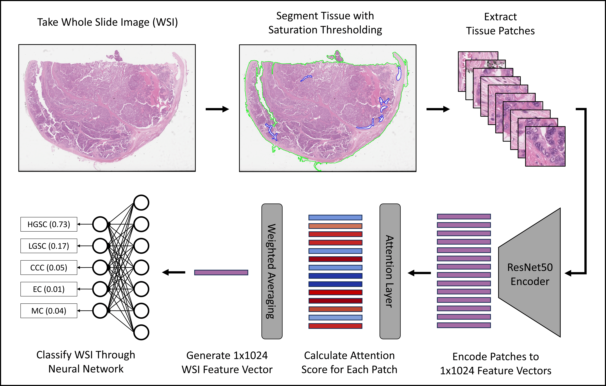

## Comparative Evaluation of Ovarian Carcinoma Subtyping in Primary versus Interval Debulking Surgery Specimen Whole Slide Images using Artificial Intelligence


*Pre-treatment (primary) and post-treatment (IDS) specicimens are highly visually distinct, but both are beneficial in training an ovarian cancer subtyping model*



Inital results were [presented at the 24th European Congress on Gynaecological Oncology (ESGO 2023)](https://ijgc.bmj.com/content/33/Suppl_3/A429.abstract), and final results submitted for publication in a journal.  

in which the performance of an attention-based multiple instance learning (ABMIL) model was compared for classifying ovarian cancer subtypes when trained with only primary surgery WSIs versus both primary and interval debulking surgery (IDS) WSIs. 

## Hyperparameters
Final Hyperparamters Determined by Hyperparameter Tuning: 
| Training Set | Learning Rate | Weight Decay | First Moment Decay | Second Moment Decay | Attention Layer Size | Dropout | Max Patches |
| :-------: | :-------------: | :------------: |:------------------:|:-------------------: | :--------------------: | :-------: | :-----------: |
| Staging-Only    | 5e-4          | 1e-5         |        0.95        | 0.99                | 256                  | 0.7     | 8000        |
| Staging+IDS     | 5e-4          | 1e-4         |        0.99        | 0.99                | 512                  | 0.6     | 10000       |
| Staging+Staging | 5e-4          | 1e-4         |        0.95        | 0.999               | 128                  | 0.5     | 6000        |

Hyperparameters were tuned in 4 stages in which 1-3 individual hyperparameters were altered and the rest were frozen.
- Stage 1: Learning Rate, Dropout, Max Patches
- Stage 2: Weight Decay, Attention Layer Size
- Stage 3 (Only if Attention Layer Size changed): Dropout, Max Patches
- Stage 4: First Moment Decay, Second Moment Decay

## Code Examples - Final Results
The following code was used in producing the final results, including hyperparameter tuning and evaluation. Initial hyperparameters were taken from the 20x magnification model in [our previous work](https://github.com/scjjb/Ovarian_Subtype_Mags). 

<details>
<summary>
Patch features extraction
</summary>
We segmented tissue using saturation thresholding and extracted non-overlapping 512x512 tissue regions at 40x magnification. We then downsampled these to 256x256 patches at 20x magnification and extracted [1,1024] features from each patch using a ResNet50 encoder pretrained on ImageNet:

``` shell
python create_patches_fp.py --source "/mnt/data/Katie_WSI/edrive" --save_dir "/mnt/results/patches/ovarian_leeds_mag40x_patch512_DGX_fp" --patch_size 512 --step_size 512 --seg --patch --stitch 	
python extract_features_fp.py --hardware DGX --custom_downsample 2 --model_type 'resnet50' --data_h5_dir "/mnt/results/patches/ovarian_leeds_mag40x_patch512_DGX_fp" --data_slide_dir "/mnt/data/Katie_WSI/edrive" --csv_path "dataset_csv/set_edrivepatches_ESGO_train_staging.csv" --feat_dir "/mnt/results/features/ovarian_leeds_resnet50_20x_features_DGX" --batch_size 32 --slide_ext .svs 
``` 
</details>


<details>
<summary>
Hyperparameter Tuning
</summary>
Models were tuned using configurations in the folder "tuning_configs", with a separate call used for each of the five cross-validation folds to allow for parallelisation:

``` shell
## Staging+IDS tuning first stage first fold
python main.py --tuning --hardware DGX --tuning_output_file /mnt/results/tuning_results/stagingplusIDS_updated_firsttuning_fold0.csv --min_epochs 0 --early_stopping --num_tuning_experiments 1 --split_dir "esgo_all_5fold_100" --k 1 --results_dir /mnt/results --exp_code stagingplusIDS_updated_1thtuning_fold0 --subtyping --weighted_sample --bag_loss balanced_ce --no_inst_cluster --task ovarian_5class --max_epochs 150 --model_type clam_sb --subtyping --csv_path 'dataset_csv/ESGO_train_all.csv' --data_root_dir "/mnt/results/features" --features_folder "ovarian_leeds_resnet50_20x_features_DGX" --tuning_config_file tuning_configs/esgo_stagingonly_updated_resnet50_20x_config1.txt
```

After running all folds for a given magnification and tuning stage, the validation set balanced cross-entropy loss values were summarised into a csv for analysis:

``` shell
python combine_results.py --file_base_name "/mnt/results/tuning_results/stagingplusIDS_updated_firsttuning"
```

</details>

<details>
<summary>
Model training
</summary>
The best model for each training set from hyperparameter tuning was trained:

``` shell
## Staging+IDS
python main.py --hardware DGX --min_epochs 0 --early_stopping --drop_out 0.6 --lr 0.0005 --reg 0.0001 --max_patches_per_slide 10000 --beta1 0.99 --beta2 0.99 --eps 1e-8 --split_dir "esgo_all_5fold_100" --k 5 --results_dir /mnt/results --exp_code stagingplusids_updated_bestfromtuning_drop6_lr0005_reg0001_small_patch10000 --subtyping --weighted_sample --bag_loss balanced_ce --no_inst_cluster --task ovarian_5class --max_epochs 1000 --model_type clam_sb --model_size small --subtyping --csv_path 'dataset_csv/ESGO_train_all.csv' --data_root_dir "/mnt/results/features" --features_folder "ovarian_leeds_resnet50_20x_features_DGX"
```

</details>

<details>
<summary>
Model evaluation
</summary>
The models were evaluated on the test sets of the five-fold cross validation with 5000 iterations of bootstrapping:

``` shell
python eval.py --drop_out 0.6 --model_size small --models_exp_code stagingplusids_updated_bestfromtuning_drop6_lr0005_reg0001_small_patch10000_s1 --save_exp_code stagingplusids_updated_bestfromtuning_drop6_lr0005_reg0001_small_patch10000_bootstrapping --task ovarian_5class --model_type clam_sb --results_dir /mnt/results --data_root_dir "/mnt/results/features" --k 5 --features_folder "ovarian_leeds_resnet50_20x_features_DGX" --csv_path 'dataset_csv/ESGO_train_all.csv'
python bootstrapping.py --num_classes 5 --model_names stagingplusids_updated_bestfromtuning_drop6_lr0005_reg0001_small_patch10000_bootstrapping --bootstraps 5000 --run_repeats 1 --folds 5
```

The models were also evaluated on the balanced hold-out test set with 5000 iterations of bootstrapping:
``` shell
python eval.py --drop_out 0.6 --model_size small --models_exp_code stagingplusids_updated_bestfromtuning_drop6_lr0005_reg0001_small_patch10000_s1 --save_exp_code stagingplusids_updated_bestfromtuning_drop6_lr0005_reg0001_small_patch10000_testset_bootstrapping --task ovarian_5class --model_type clam_sb --results_dir /mnt/results --data_root_dir "/mnt/results/features" --k 5 --features_folder "ovarian_leeds_resnet50_20x_features_DGX" --csv_path 'dataset_csv/ESGO_test_set.csv' --split_dir splits/esgo_test_splits
python bootstrapping.py --num_classes 5 --model_names stagingplusids_updated_bestfromtuning_drop6_lr0005_reg0001_small_patch10000_testset_bootstrapping --bootstraps 5000 --run_repeats 1 --folds 5
```

</details>

## Code Examples - ESGO
The following code was used in producing the inital results presented at ESGO. This part did not include any hyperparameter tuning, and did not include an evaluation of an increased number of staging specimens alone. 

<details>
<summary>
Model training
</summary>

Primary surgery specimens only
``` shell
python main.py --hardware PC --min_epochs 0 --early_stopping --drop_out 0.75 --lr 0.0001 --reg 0.0001 --max_patches_per_slide 5000 --split_dir "esgo_staging_alltrain_100" --k 1 --results_dir results --exp_code esgo_staging_drop75lr0001reg0001_5000patches_ABMILsb_ce_802000split --weighted_sample --bag_loss ce --no_inst_cluster --task ovarian_5class --max_epochs 200 --model_type clam_sb --model_size small --log_data --subtyping --csv_path 'dataset_csv/ESGO_train_staging.csv' --data_root_dir "../mount_i/features" --features_folder "ovarian_dataset_features_256_patches_20x"
```

Primary surgery plus IDS specimens
``` shell
python main.py --hardware PC --min_epochs 0 --early_stopping --drop_out 0.75 --lr 0.0001 --reg 0.0001 --max_patches_per_slide 5000 --split_dir "esgo_all_alltrain_100" --k 1 --results_dir results --exp_code esgo_all_drop75lr0001reg0001_5000patches_ABMILsb_ce_802000split_plusidstraining --weighted_sample --bag_loss ce --no_inst_cluster --task ovarian_5class --max_epochs 200 --model_type clam_sb --model_size small --log_data --subtyping --csv_path 'dataset_csv/ESGO_train_all.csv' --data_root_dir "../mount_i/features" --features_folder "ovarian_dataset_features_256_patches_20x"
```
</details>

<details>
<summary>
Model evaluation
</summary>

Primary surgery specimens only
``` shell
python eval.py --drop_out 0.75 --model_size small --models_exp_code esgo_staging_drop75lr0001reg0001_5000patches_ABMILsb_ce_802000split_s1 --save_exp_code esgo_staging_drop75lr0001reg0001_5000patches_ABMILsb_ce_802000split_bootstrapping --task ovarian_5class --model_type clam_sb --results_dir results --data_root_dir "../mount_i/features" --fold 100 --features_folder "ovarian_dataset_features_256_patches_20x" --csv_path 'dataset_csv/ESGO_test_set.csv'
python bootstrapping.py --num_classes 5 --model_names esgo_staging_drop75lr0001reg0001_5000patches_ABMILsb_ce_802000split_bootstrapping --bootstraps 100000 --run_repeats 1 --folds 1
```

Primary surgery plus IDS specimens
``` shell
python eval.py --drop_out 0.75 --model_size small --models_exp_code esgo_all_drop75lr0001reg0001_5000patches_ABMILsb_ce_802000split_plusidstraining_s1 --save_exp_code esgo_all_drop75lr0001reg0001_5000patches_ABMILsb_ce_802000split_plusidstraining_bootstrapping --task ovarian_5class --model_type clam_sb --results_dir results --data_root_dir "../mount_i/features" --fold 100 --features_folder "ovarian_dataset_features_256_patches_20x" --csv_path 'dataset_csv/ESGO_test_set.csv'
python bootstrapping.py --num_classes 5 --model_names esgo_all_drop75lr0001reg0001_5000patches_ABMILsb_ce_802000split_plusidstraining_bootstrapping --bootstraps 100000 --run_repeats 1 --folds 1
```

</details>

## Reference
This code is an extension of our [previous repository](https://github.com/scjjb/DRAS-MIL), which itself was forked from the [CLAM repository](https://github.com/mahmoodlab/CLAM) with corresponding [paper](https://www.nature.com/articles/s41551-020-00682-w). This repository and the original CLAM repository are both available for non-commercial academic purposes under the GPLv3 License.
